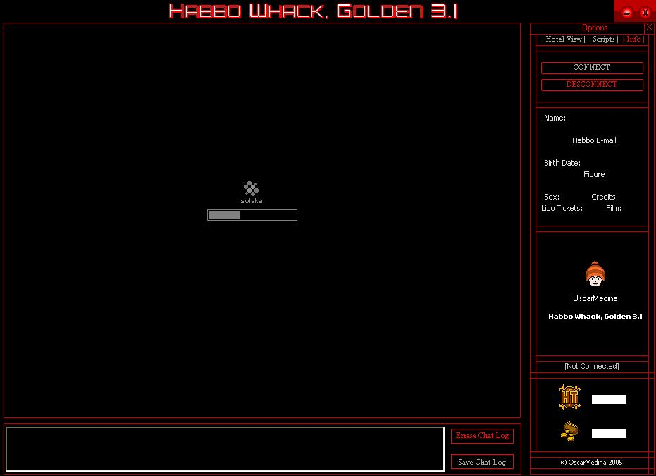



## Habbo Whack 3\.1

### Description

Its a Scripting Tool For Habbo Hotel it supports 4 hotels in this version, it auto geneates its connection and temp files necesary to connect to Habbo so it wont stop working in any habbo servers change(ports, version, servers, ip)

It has many script examples and its a lot better than last Habbo Whack posted on psc :D

I wrote it long time ag&#243;, i just fixed some bugs and submitted it....

Hope you love it, it comes with paint wlls and floor tutorials(clientside)
 
### More Info
 

             |
---                |---
**Submitted On**   |2005-11-26 13:12:16
**By**             |[OscarMedina](https://github.com/Planet-Source-Code/PSCIndex/blob/master/ByAuthor/oscarmedina.md)
**Level**          |Advanced
**User Rating**    |5.0 (15 globes from 3 users)
**Compatibility**  |VB 6\.0
**Category**       |[Games](https://github.com/Planet-Source-Code/PSCIndex/blob/master/ByCategory/games__1-38.md)
**World**          |[Visual Basic](https://github.com/Planet-Source-Code/PSCIndex/blob/master/ByWorld/visual-basic.md)
**Archive File**   |[Habbo\_Whac19512011262005\.zip](https://github.com/Planet-Source-Code/oscarmedina-habbo-whack-3-1__1-63378/archive/master.zip)

